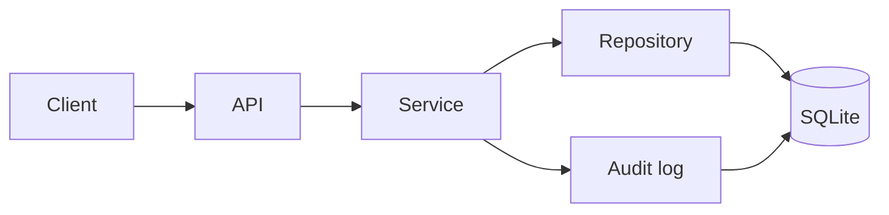

# SaaS Agent Lab

A small B2B SaaS administration system for users, licences, licence assignments
and an audit log. The application is built around explicit service and persistence
boundaries, transactional writes and testable business rules.

Later versions add verified agent workflows through the API and, eventually,
through the browser.

**Status:** v0.1 in progress. Users can be created, listed and fetched through
the API, with mutations recorded in the audit log. Licences, assignments,
user deactivation and the UI are next.

## Stack

Python 3.12 · FastAPI · SQLAlchemy 2 · Alembic · Pydantic v2 · SQLite · pytest · Ruff · Pyright · uv


## Run locally

```bash
uv sync
uv run alembic upgrade head
uv run uvicorn app.main:app --reload
```

Check the service at <http://127.0.0.1:8000/health>. Settings use `SAL_*`
environment variables; see [`.env.example`](.env.example).

## API

| Method | Path | |
|---|---|---|
| `POST` | `/users` | Create a user (email is trimmed and lowercased) |
| `GET` | `/users` | List users, ordered by id |
| `GET` | `/users/{user_id}` | Fetch one user |

Mutating endpoints require an `X-Actor` header. Its value is recorded on the audit event as the actor responsible for the change.

`X-Actor` is trusted caller-supplied identity for audit provenance, not
authentication. Any caller can provide any value. Read endpoints do not
require it.

```bash
curl -X POST http://127.0.0.1:8000/users \
  -H "X-Actor: admin@example.com" \
  -H "Content-Type: application/json" \
  -d '{"email": "ada@example.com", "name": "Ada Lovelace"}'
```

## Test and lint

```bash
uv run pytest
uv run ruff check .
uv run ruff format --check .
uv run pyright
```

Tests use in-memory SQLite and do not access a real database or the network.

## Architecture



```
src/app/
  api/           # HTTP routes and request transaction boundary
  schemas/       # Pydantic request/response models
  services/      # business rules; never commit or roll back
  repositories/  # database queries; add and flush, never commit
  models/        # SQLAlchemy models
  core/          # settings and database setup
alembic/         # database migrations
tests/           # API, service, model and migration tests
```

Application requests flow `api → services → repositories → database`.

Each mutating request runs inside
one transaction, owned by `get_transaction` in `api/deps.py`. Business changes and their
audit events are committed together, or rolled back together.

## Roadmap

- **v0.1** SaaS application: CRUD, audit log, constraints, static UI, tests, type checking
- **v0.2** Verified action layer: typed actions, policy, approval, execution, postcondition checks
- **v0.3** Agent planning and evaluation: natural-language requests to typed plans, frozen eval scenarios
- **v0.4** Browser execution: the same workflows through the UI with Playwright
- **v0.5** Production hardening: Postgres, authentication and authorization, idempotency, concurrency, retries, observability
- **v1.0** Public release: Docker Compose, architecture diagram, eval results, documented demo
