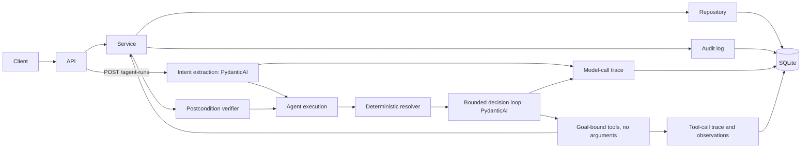

# SaaS Agent Lab

A B2B SaaS administration system for exploring safe, verifiable autonomous-agent execution over real application state.

The application provides users, licences, assignments, revocation and audit logging behind explicit service and persistence boundaries. On top of that, the agent execution layer now provides persisted runs and tool calls, deterministic entity resolution, goal-scoped typed actions, independent execution logging, and state-based postcondition verification.

A language model (via PydanticAI) has two bounded jobs. First, it extracts what a natural-language instruction asks for into a closed, id-free intent, which goes to the deterministic resolver. Then, after resolution, it chooses which of four goal-bound tools to call, and when to stop. None of those tools takes an argument, so the application alone decides what they act on. Every model request, tool call and model-visible observation is persisted in the run's trace. Application state remains authoritative for identity, business rules, transaction success and goal satisfaction.

A small HTTP surface runs an instruction through that whole flow and returns the persisted run, including a trace of what the model was shown.

**Status:** Agent execution foundation, natural-language intent extraction, bounded model-directed execution and synchronous agent-run endpoints implemented, with an opt-in live-model smoke test. Not production-ready: runs execute inside the request, with no background execution, crash recovery, approvals, policy checks or cancellation yet.

## Stack

Python 3.12 · FastAPI · SQLAlchemy 2 · Alembic · Pydantic v2 · PydanticAI · SQLite · pytest · Ruff · Pyright · uv


## Run locally

```bash
uv sync
uv run alembic upgrade head
uv run uvicorn app.main:app --reload
```

Check the service at <http://127.0.0.1:8000/health>. Settings use `SAL_*`
environment variables; see [`.env.example`](.env.example).

## API

| Method | Path | Description |
|---|---|---|
| `GET` | `/health` | Liveness check |
| `POST` | `/users` | Create a user |
| `GET` | `/users` | List users |
| `GET` | `/users/{user_id}` | Fetch one user |
| `POST` | `/licences` | Create a licence |
| `GET` | `/licences` | List licences |
| `GET` | `/licences/{licence_id}` | Fetch one licence |
| `POST` | `/assignments` | Assign a licence seat to a user |
| `GET` | `/assignments` | List active assignments |
| `POST` | `/assignments/{assignment_id}/revoke` | Revoke an active assignment |
| `POST` | `/agent-runs` | Run a natural-language instruction to a terminal status |
| `GET` | `/agent-runs/{run_id}` | Fetch one run with its decision context, verification and trace |

Mutating endpoints require an `X-Actor` header. Its value is recorded on the audit event as the actor responsible for the change.

`X-Actor` is trusted caller-supplied identity for audit provenance, not authentication. External callers cannot use the reserved `agent:` namespace. Read endpoints do not require it.

```bash
curl -X POST http://127.0.0.1:8000/users \
  -H "X-Actor: admin@example.com" \
  -H "Content-Type: application/json" \
  -d '{"email": "ada@example.com", "name": "Ada Lovelace"}'
```

### Agent runs

`POST /agent-runs` takes one instruction and runs it synchronously: extraction, deterministic resolution, the bounded decision loop and verification all happen before the response is sent. It needs the configured provider's API key (e.g. `ANTHROPIC_API_KEY`). Without one the application still starts, and a run ends `failed` with `planner_error`.

```bash
curl -X POST http://127.0.0.1:8000/agent-runs \
  -H "X-Actor: admin@example.com" \
  -H "Content-Type: application/json" \
  -d '{"instruction": "Ensure ada@example.com has a GitHub Enterprise licence"}'
```

```json
{
  "id": 1,
  "instruction": "Ensure ada@example.com has a GitHub Enterprise licence",
  "requesting_actor": "admin@example.com",
  "status": "completed",
  "outcome_reason": "goal_satisfied",
  "outcome_code": null,
  "goal": {"kind": "ensure_assignment", "user_email": "ada@example.com", "product": "GitHub Enterprise"},
  "decision_proposal": {"kind": "goal_reached"},
  "created_at": "2026-09-28T10:15:02.114203Z",
  "completed_at": "2026-09-28T10:15:09.871455Z"
}
```

The response is `201` whenever a run was created, however it ended: `completed`, `blocked`, `needs_clarification` or `failed` is the run's outcome, not an HTTP error. `422` means no run was created (a malformed body, or a missing, blank or reserved `X-Actor`). The change itself is audited as `agent:run-<id>`, and the requesting actor is stored on the run.

`GET /agent-runs/{run_id}` adds what the decision model was first told (`decision_context`), what the application verified at the end (`verification`), and the run's `trace`: model calls and tool calls in one order. A tool call appears under the model-facing tool name, with the exact observation the model was given:

```json
{"kind": "tool_call", "sequence_no": 5, "tool": "assign_target_licence", "status": "succeeded", "error_code": null, "observation": "{\"outcome\":\"assigned\",\"reason_code\":null}"}
```

The trace shows what the model was allowed to know. It is not a database snapshot: resolved user and licence ids, tool arguments, internal results and exception messages are never returned. Everything is read from what was persisted when it happened, never recomputed from current state.

## Test and lint

```bash
uv run pytest
uv run ruff check .
uv run ruff format --check .
uv run pyright
```

Tests use isolated SQLite databases and do not access production infrastructure or the network. Real model requests are blocked in tests, which use scripted models and need no API key.

One optional smoke test sends a real instruction to the configured model through `POST /agent-runs`. `uv run pytest` never runs it. It runs only when you select it and the provider's key is set; otherwise it is skipped. Its requests are real and billable.

Linux or macOS (the key is set for this one command):

```bash
ANTHROPIC_API_KEY=... uv run pytest -m live
```

Windows PowerShell (the key stays set for the rest of the session):

```powershell
$env:ANTHROPIC_API_KEY = "..."
uv run pytest -m live
```

Windows Command Prompt (likewise for the session; no quotes or trailing spaces around the value):

```bat
set ANTHROPIC_API_KEY=...
uv run pytest -m live
```

## Architecture


```mermaid
flowchart LR
    Client --> API
    API --> Service
    Service --> Repository
    Repository --> DB[(SQLite)]

    Service --> Audit[Audit log]
    Audit --> DB

    API -->|POST /agent-runs| Planner[Intent extraction: PydanticAI]
    Planner --> ModelTrace[Model-call trace]
    Planner --> AgentRun[Agent execution]
    AgentRun --> Resolver[Deterministic resolver]
    Resolver --> Decision[Bounded decision loop: PydanticAI]
    Decision --> ModelTrace
    Decision --> Tools[Goal-bound tools, no arguments]
    Tools --> Service
    Tools --> Trace[Tool-call trace and observations]
    ModelTrace --> DB
    Trace --> DB

    Service --> Verifier[Postcondition verifier]
    Verifier --> AgentRun
```

```text
src/app/
  api/           # HTTP routes, request transaction boundary, agent-run endpoints
  agent/         # planners, resolver, verifier, typed and goal-bound tools, observations, executor and harness
  schemas/       # Pydantic request/response and agent contracts
  services/      # business rules; never commit or roll back
  repositories/  # database queries; add and flush, never commit
  models/        # SQLAlchemy models including AgentRun, ToolCall and ModelCall
  core/          # settings and database setup

alembic/         # database migrations
tests/           # API, service, model, agent and migration tests
```

Ordinary application requests flow `api → services → repositories → database`.

Agent execution uses short, separate transaction boundaries so execution history survives failed business mutations. Agent-initiated mutations reuse the same application services and keep the business change and its audit event atomic. The agent-run endpoints therefore take no request transaction. They run in a worker thread, and no transaction is open while a model is waited on.

Model calls and tool calls share one per-run sequence, so a run's trace has a single order that never depends on timestamps.

In the decision loop the model sees id-free observations, never internal results. Each is serialized once, persisted with its tool call and returned to the model as that same text, so what the model knew before each decision can be read back later. Its initial instructions and prompt are persisted verbatim for the same reason. Model requests, read calls and mutation attempts are capped by application code, and reaching a cap ends the run. Nothing is read on the model's behalf: it may even attempt the assignment without looking, and the domain rules reject it as they would any caller.

Final success is determined by querying application state against the persisted resolved goal, not by trusting a tool result or model-generated claim. The decision model concludes with a closed proposal (goal reached, no action needed, or cannot proceed with a reason code), which is recorded as its opinion. A "cannot proceed" claim blocks a run only if the application confirms that condition against current state.

## Roadmap

- **v0.1 — SaaS application:** user and licence create/list/get flows, assignment creation and revocation, audit logging, validation, transaction boundaries and tests

- **v0.2 — Agent execution foundation:** persisted runs and tool calls, deterministic goal resolution, goal-scoped typed tools, structured traces and postcondition verification

- **v0.3 — Autonomous planning and human control:** natural-language requests, bounded model planning, planner-visible observations, policy checks, approval checkpoints, cancellation and controlled recovery

- **v0.4 — Browser execution and operator UI:** execute the same workflows through the browser with Playwright, expose agent runs and approval state in a web interface, and compare API-tool execution with browser-based execution

- **v0.5 — Agent evaluation:** frozen scenarios, state-based success metrics, counter-evidence exposure, approval-surface coverage, model comparison, latency, token use and cost

- **v0.6 — Production hardening:** PostgreSQL, authentication and authorization, durable execution, idempotency, concurrency controls, retries, crash recovery, observability and rate limits

- **v1.0 — Public release:** deployed application, operator console, reproducible evaluation results, architecture documentation and documented demo workflows