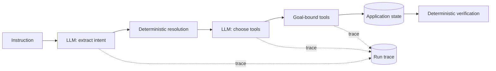

# SaaS Agent Lab

A B2B SaaS administration system (users, licences, seat assignments, audit log) for exploring bounded, verifiable AI-agent execution over real application state.

A model interprets a natural-language request and chooses among goal-bound tools. Application code resolves identity, enforces business rules and verifies the result against committed state, never against the model's claims.

**Status:** natural-language intent extraction, bounded model-directed execution, deterministic verification, persisted run traces and a synchronous agent HTTP API are implemented. Not production-ready: runs execute inside the request, and `X-Actor` is caller-supplied audit identity, not authentication.

## Stack

Python 3.12 · FastAPI · SQLAlchemy 2 · Alembic · Pydantic v2 · PydanticAI · SQLite · pytest · Ruff · Pyright · uv

## Architecture


```mermaid
flowchart LR
    I[Instruction] --> X[LLM: extract intent]
    X --> R[Deterministic resolution]
    R --> D[LLM: choose tools]
    D --> T[Goal-bound tools]
    T --> A[(Application state)]
    A --> V[Deterministic verification]
    X -. trace .-> L[(Run trace)]
    D -. trace .-> L
    T -. trace .-> L
```

The model chooses what to observe and whether to act. Application code stays authoritative for which user and licence are meant, business rules, transactions and whether the goal holds. Tools take no arguments, and the model sees only id-free observations, persisted exactly as it saw them.

## Run locally

```bash
uv sync
uv run alembic upgrade head
uv run uvicorn app.main:app --reload
```

Settings use `SAL_*` environment variables; see [`.env.example`](.env.example). Agent runs also need the model provider's key (e.g. `ANTHROPIC_API_KEY`) in the process environment: the provider's SDK reads it from there, not from `.env`. Without it the application still starts, and agent runs end `failed` with `planner_error`.

## API

| Method | Path | Description |
|---|---|---|
| `GET` | `/health` | Liveness check |
| `POST` | `/users` | Create a user |
| `GET` | `/users` | List users |
| `GET` | `/users/{user_id}` | Fetch one user |
| `POST` | `/licences` | Create a licence |
| `GET` | `/licences` | List licences |
| `GET` | `/licences/{licence_id}` | Fetch one licence |
| `POST` | `/assignments` | Assign a licence seat to a user |
| `GET` | `/assignments` | List active assignments |
| `POST` | `/assignments/{assignment_id}/revoke` | Revoke an active assignment |
| `POST` | `/agent-runs` | Run a natural-language instruction to a terminal status |
| `GET` | `/agent-runs/{run_id}` | Fetch one run with its verification and trace |

Mutating endpoints require an `X-Actor` header, recorded on the audit event. The `agent:` namespace is reserved: an agent's changes are audited as `agent:run-<id>`.

```bash
curl -X POST http://127.0.0.1:8000/agent-runs \
  -H "X-Actor: admin@example.com" \
  -H "Content-Type: application/json" \
  -d '{"instruction": "Ensure ada@example.com has a GitHub Enterprise licence"}'
```

`POST /agent-runs` runs synchronously and returns `201` whenever a run is created. The outcome (`completed`, `blocked`, `needs_clarification` or `failed`) is in the body, not the status code. `GET /agent-runs/{run_id}` adds the ordered trace of model calls and tool calls, with each observation exactly as the model saw it. Internal ids, tool arguments and exception messages are never returned.

## Tests

```bash
uv run pytest
uv run ruff check .
uv run ruff format --check .
uv run pyright
```

Tests use in-memory SQLite and scripted models, and never call a real model provider. One opt-in smoke test does, with real, billable requests. It runs only with `uv run pytest -m live`, and skips unless `ANTHROPIC_API_KEY` is set.

<details>
<summary>Running the live test on each shell</summary>

Linux or macOS (the key is set for this one command):

```bash
ANTHROPIC_API_KEY=... uv run pytest -m live
```

Windows PowerShell (the key stays set for the rest of the session):

```powershell
$env:ANTHROPIC_API_KEY = "..."
uv run pytest -m live
```

Windows Command Prompt (likewise for the session; no quotes or trailing spaces around the value):

```bat
set ANTHROPIC_API_KEY=...
uv run pytest -m live
```

</details>

## Roadmap

- **v0.1.0:** SaaS application: users, licences, assignments, audit log
- **v0.2.0:** deterministic agent execution: persisted runs, goal-scoped tools, verification
- **v0.3.0:** natural-language planning, bounded model-directed execution, agent HTTP API
- **Next:** policy checks, approval checkpoints and cancellation; then browser execution with an operator UI, agent evaluation, and production hardening (PostgreSQL, authentication, durable execution)
