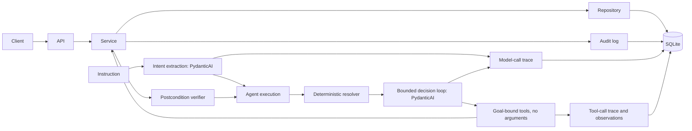

# SaaS Agent Lab

A B2B SaaS administration system for exploring safe, verifiable autonomous-agent execution over real application state.

The application provides users, licences, assignments, revocation and audit logging behind explicit service and persistence boundaries. On top of that, the agent execution layer now provides persisted runs and tool calls, deterministic entity resolution, goal-scoped typed actions, independent execution logging, and state-based postcondition verification.

A language model (via PydanticAI) has two bounded jobs. First, it extracts what a natural-language instruction asks for into a closed, id-free intent, which goes to the deterministic resolver. Then, after resolution, it chooses which of four goal-bound tools to call, and when to stop. None of those tools takes an argument, so the application alone decides what they act on. Every model request, tool call and model-visible observation is persisted in the run's trace. Application state remains authoritative for identity, business rules, transaction success and goal satisfaction.

**Status:** Agent execution foundation, natural-language intent extraction and bounded model-directed execution implemented. HTTP endpoints for agent runs, approvals and a live-provider test are not built yet.

## Stack

Python 3.12 · FastAPI · SQLAlchemy 2 · Alembic · Pydantic v2 · PydanticAI · SQLite · pytest · Ruff · Pyright · uv


## Run locally

```bash
uv sync
uv run alembic upgrade head
uv run uvicorn app.main:app --reload
```

Check the service at <http://127.0.0.1:8000/health>. Settings use `SAL_*`
environment variables; see [`.env.example`](.env.example).

## API

| Method | Path | Description |
|---|---|---|
| `GET` | `/health` | Liveness check |
| `POST` | `/users` | Create a user |
| `GET` | `/users` | List users |
| `GET` | `/users/{user_id}` | Fetch one user |
| `POST` | `/licences` | Create a licence |
| `GET` | `/licences` | List licences |
| `GET` | `/licences/{licence_id}` | Fetch one licence |
| `POST` | `/assignments` | Assign a licence seat to a user |
| `GET` | `/assignments` | List active assignments |
| `POST` | `/assignments/{assignment_id}/revoke` | Revoke an active assignment |

Mutating endpoints require an `X-Actor` header. Its value is recorded on the audit event as the actor responsible for the change.

`X-Actor` is trusted caller-supplied identity for audit provenance, not authentication. External callers cannot use the reserved `agent:` namespace. Read endpoints do not require it.

```bash
curl -X POST http://127.0.0.1:8000/users \
  -H "X-Actor: admin@example.com" \
  -H "Content-Type: application/json" \
  -d '{"email": "ada@example.com", "name": "Ada Lovelace"}'
```

## Test and lint

```bash
uv run pytest
uv run ruff check .
uv run ruff format --check .
uv run pyright
```

Tests use isolated SQLite databases and do not access production infrastructure or the network. Real model requests are blocked in tests, which use scripted models and need no API key.

## Architecture


```mermaid
flowchart LR
    Client --> API
    API --> Service
    Service --> Repository
    Repository --> DB[(SQLite)]

    Service --> Audit[Audit log]
    Audit --> DB

    Instruction --> Planner[Intent extraction: PydanticAI]
    Planner --> ModelTrace[Model-call trace]
    Planner --> AgentRun[Agent execution]
    AgentRun --> Resolver[Deterministic resolver]
    Resolver --> Decision[Bounded decision loop: PydanticAI]
    Decision --> ModelTrace
    Decision --> Tools[Goal-bound tools, no arguments]
    Tools --> Service
    Tools --> Trace[Tool-call trace and observations]
    ModelTrace --> DB
    Trace --> DB

    Service --> Verifier[Postcondition verifier]
    Verifier --> AgentRun
```

```text
src/app/
  api/           # HTTP routes and request transaction boundary
  agent/         # planners, resolver, verifier, typed and goal-bound tools, observations, executor and harness
  schemas/       # Pydantic request/response and agent contracts
  services/      # business rules; never commit or roll back
  repositories/  # database queries; add and flush, never commit
  models/        # SQLAlchemy models including AgentRun, ToolCall and ModelCall
  core/          # settings and database setup

alembic/         # database migrations
tests/           # API, service, model, agent and migration tests
```

Ordinary application requests flow `api → services → repositories → database`.

Agent execution uses short, separate transaction boundaries so execution history survives failed business mutations. Agent-initiated mutations reuse the same application services and keep the business change and its audit event atomic.

Model calls and tool calls share one per-run sequence, so a run's trace has a single order that never depends on timestamps.

In the decision loop the model sees id-free observations, never internal results. Each is serialized once, persisted with its tool call and returned to the model as that same text, so what the model knew before each decision can be read back later. Its initial instructions and prompt are persisted verbatim for the same reason. Model requests, read calls and mutation attempts are capped by application code, and reaching a cap ends the run. Nothing is read on the model's behalf: it may even attempt the assignment without looking, and the domain rules reject it as they would any caller.

Final success is determined by querying application state against the persisted resolved goal, not by trusting a tool result or model-generated claim. The decision model concludes with a closed proposal (goal reached, no action needed, or cannot proceed with a reason code), which is recorded as its opinion. A "cannot proceed" claim blocks a run only if the application confirms that condition against current state.

## Roadmap

- **v0.1 — SaaS application:** user and licence create/list/get flows, assignment creation and revocation, audit logging, validation, transaction boundaries and tests

- **v0.2 — Agent execution foundation:** persisted runs and tool calls, deterministic goal resolution, goal-scoped typed tools, structured traces and postcondition verification

- **v0.3 — Autonomous planning and human control:** natural-language requests, bounded model planning, planner-visible observations, policy checks, approval checkpoints, cancellation and controlled recovery

- **v0.4 — Browser execution and operator UI:** execute the same workflows through the browser with Playwright, expose agent runs and approval state in a web interface, and compare API-tool execution with browser-based execution

- **v0.5 — Agent evaluation:** frozen scenarios, state-based success metrics, counter-evidence exposure, approval-surface coverage, model comparison, latency, token use and cost

- **v0.6 — Production hardening:** PostgreSQL, authentication and authorization, durable execution, idempotency, concurrency controls, retries, crash recovery, observability and rate limits

- **v1.0 — Public release:** deployed application, operator console, reproducible evaluation results, architecture documentation and documented demo workflows